# Dealer's Grafana Dashboard
##### Overview
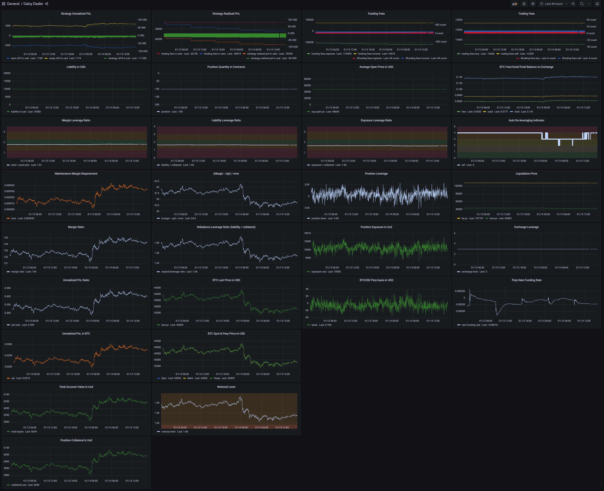

## Performance Data Charts

### Strategy Unrealized Profit and Loss
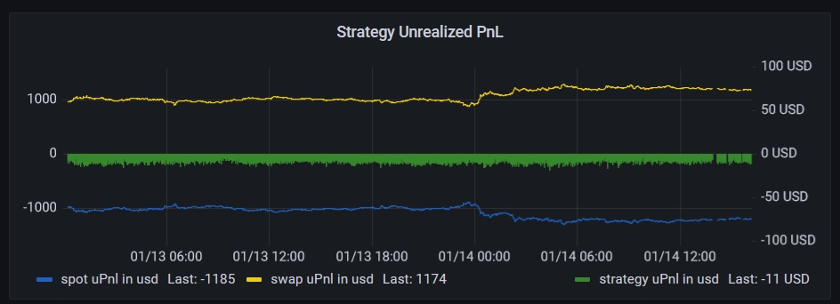

There are two components to the strategy's unrealized PnL
1. the spot position unrealized PnL

    - Assuming a spot liability of 10k USD & 0.20551605 BTC (i.e. an open price of 48,658 USD/BTC), and a current spot price of 43,700 USD/BTC, we calculate the PnL as follow:

        ``` 
        Spot PnL in USD = Balance BTC * (CurrentPrice - OpenPrice) USD/BTC
        Spot PnL in USD = 0.20551605 BTC * (43.7k - 48.658k) USD/BTC
        Spot PnL in USD = 0.20551605 BTC * (-4958) USD/BTC
        Spot PnL in USD = -1019 USD

        * assuming Balance BTC > 0 for long positions and < 0 for shorts
        ``` 

1. the derivative's position unrealized PnL

    - Assuming a perpetual swap notional of 10k USD at an open price of 48,650 USD/BTC, and a current swap price of 43,700 USD/BTC, we calculate the PnL as follow:

        ```
        Swap PnL in BTC = Balance USD * (CurrentPrice - OpenPrice) BTC/USD
        Swap PnL in BTC = 10k USD * (1/43.7k - 1/48.6k) BTC/USD
        Swap PnL in BTC = 10 USD * (1/43.7 - 1/48.6) BTC/USD
        Swap PnL in BTC = 10 * 0.00230716351 BTC
        Swap PnL in BTC = 0.0230716351 BTC

        Swap PnL in USD = 0.0230716351 BTC @ 43.7k USD/BTC = 1008 USD

        * assuming Balance USD > 0 for long positions and < 0 for shorts
        ``` 

The strategy unrealized Pnl is then:

```
Strat PnL = Sum of all positions PnL
Strat PnL = Spot PnL + Swap PnL
Strat PnL = -1019 + 1008 USD
Strat PnL = -11 USD
``` 

Further reading: [OKEx Glossary and Formulae](https://www.okex.com/support/hc/en-us/articles/360020411871-IX-Glossary-and-Formulae)

#### Hedge effectiveness

If we want to understand why there's a discrepancy between both position, we have to realize that we are dealing with two different markets driven by two different forces/processes.

So a change in price ΔS on the spot market does not generates the same price change ΔD on the derivative's market.

The Derivative's market will eventually follow, as else if it diverged it would create an arbitrage opportunity which market participants would take advantage of and cause the markets to re-converge.

If we plot ΔS vs ΔD, we can see the trend.

Using linear regression we can plot the trending line which its slope gives us the optimal hedging ratio while the R^2 gives us the hedge effectiveness, i.e. the portion of variance that is eliminated by the hedge.

In comparison we are using a hedging ratio of 1, i.e. the blue 45 degree line, which is not optimal and eliminated less of the variance.

So an improved strategy would be to calculate and use that minimum variance hedge ratio instead of the current constant 1.

##### Regression of change in spot price against change in derivative's price
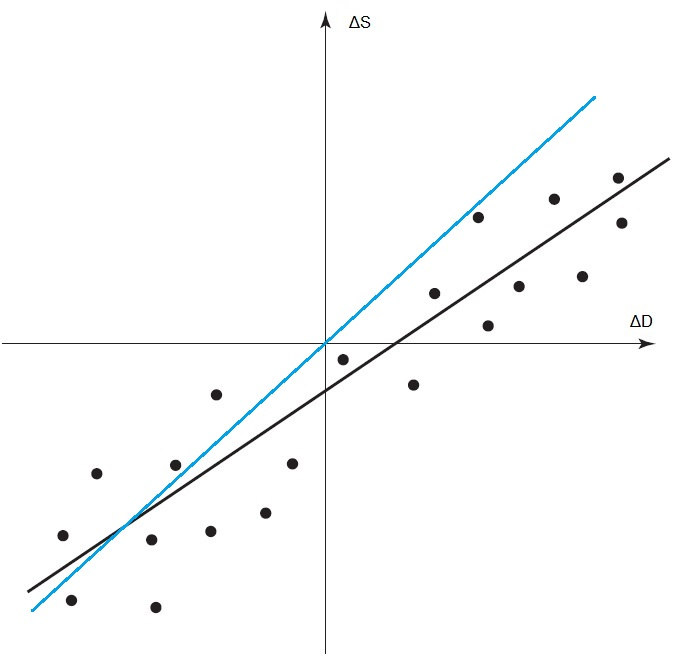


### Strategy Realized Profit and Loss
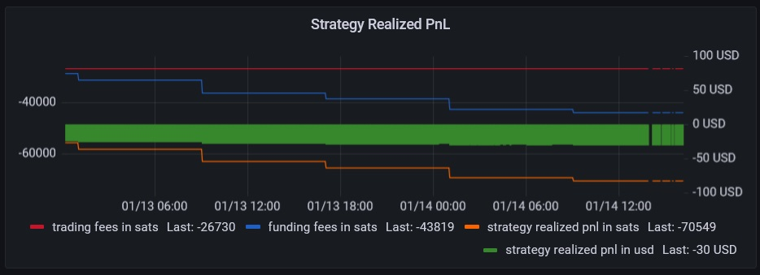

There are two components to the strategy's realized PnL
1. the funding fees
    - see [Funding Fees](./GRAFANA.md#Funding-Fees) section

1. the trading fees
    - see [Trading Fees](./GRAFANA.md#Trading-Fees) section


### Funding Fees
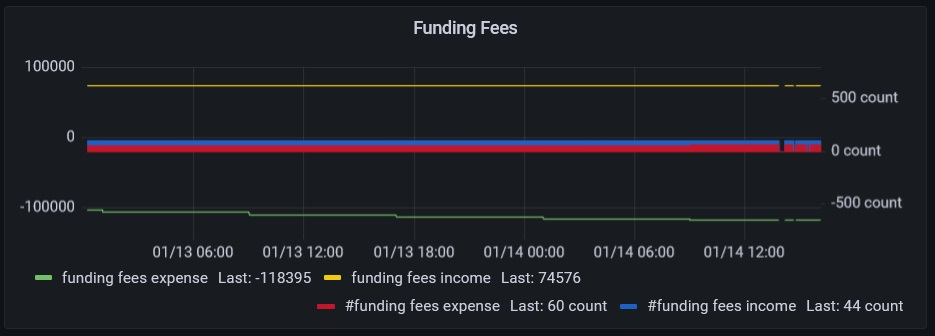

- the funding fees are there to keep the perpetual swap price in line with the spot price
- they are exchanged 3 times a day between market participants on the long and short side of the trade
- when the funding rate is negative, the shorts pay the longs
- when the funding rate is positive, the longs pay the shorts
- the dealer is either out of the market when no liability to hedge or short
- the fees are debited (expense) or credited (income) directly from/into the exchange account balance

Further reading: [OKEx Funding Rate Calculations](https://www.okex.com/support/hc/en-us/articles/360020412631-XI-Funding-Rate-Calculations)

Further reading: [OKEx Settlement](https://www.okex.com/support/hc/en-us/articles/360020154032-XII-Settlement)

### Trading Fees
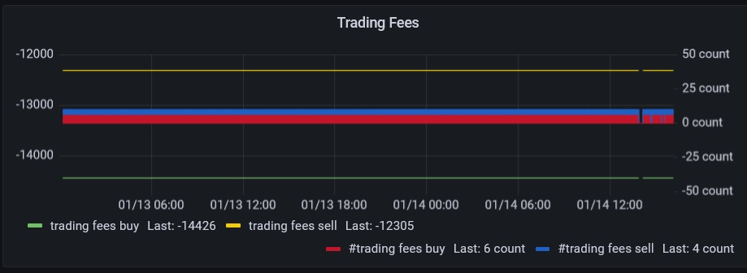

- the trading fees depend on a variety of factors (trading volume, balance on exchange, etc.)
- for example, at the lower tier a market taker order is charged 0.05% (5 basis points)
- while a market maker order is charged 0.02% (2 basis points)

Further reading: [OKEx Perpetual Swap Trading Fees](https://www.okex.com/support/hc/en-us/articles/360040120852-XIII-Perpetual-Swap-Trading-Fees)

## Positional Data Charts

### Liability in USD
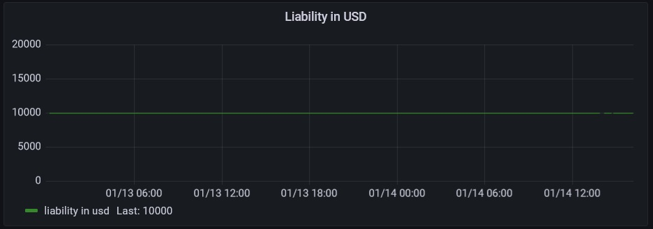

Spot position to be hedged from Galoy's aggregate user USD balances

It starts with Galoy users having a BTC balance they decide to hedge

So at the time they decide to prioritize (hedge) their USD balance, they lock in an exchange rate which is implicit given both currency balances.

The aggregate of all users BTC balances is Galoy's liability toward them, and same with the aggregate of all users USD balances

Given the liability in USD, we know the notional USD value to be hedged.

And given the associated BTC liability we can infer the average exchange rate of that aggregate "spot position".

So as BTC drops in USD terms, user would otherwise incur losses (if selling - selling realizes the losses, else losses are unrealized) and hedging is working against that to try to make up the losses and compensate to keep the USD constant.

As the liability in USD changes it triggers trading of more or less contracts to keep a constant hedging ratio 

- see [Position Quantity in Contracts](./GRAFANA.md#Position-Quantity-in-Contracts) section
- see [Position Exposure in USD](./GRAFANA.md#Position-Exposure-in-USD) section

### Position Exposure in USD
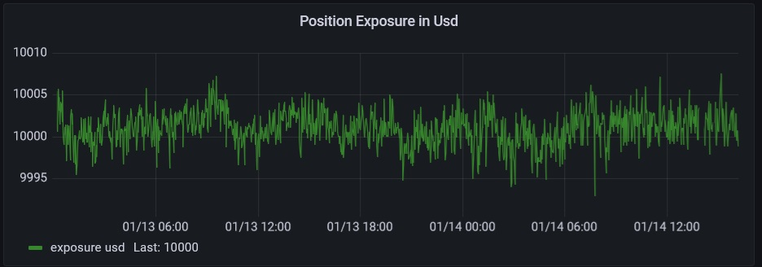

The USD amount exposed to the market, i.e. the notional USD value effectively hedged.

### Position Quantity in Contracts
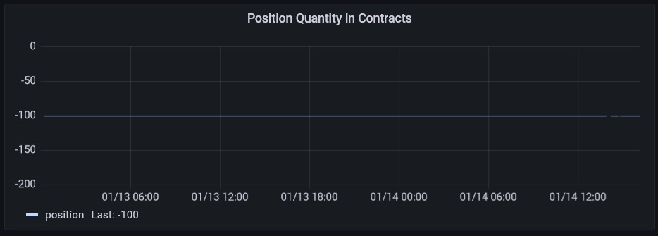

The number of derivative whole contract sold(/bought) at a face value of 100 USD for the perpetual swap.

### Average Open Price in USD
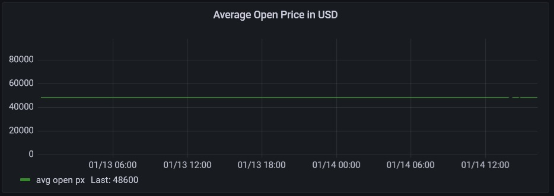

The weighted average of prices at which the current position was open. Closing the positions partially at any given price has not effect on the average open price and instead generates PnL.

(Can also be seen as the sum of BTC accumulated per face value of contract, in USD, averaged by the total number of contracts.)

This average price can be the result of discreet separate orders at different price levels or of a single order executed at different price level (ex. a market order).

#### Example calculation
##### Buying two contracts with no current position

| # contracts | price |
| ----------- | ----- |
| 1 | 60k USD/BTC |
| 1 | 40k USD/BTC |

Average Open Price = (1 + 1) / (1/60k + 1/40k) = 48k USD/BTC

##### Buying five contracts with current 6 contracts @ 50k USD/BTC position
Given a current position of 6 contracts

| # contracts | price |
| ----------- | ----- |
| 6 | 50k USD/BTC |
|  |  |
| 1 | 58k USD/BTC |
| 1 | 57k USD/BTC |
| 3 | 56k USD/BTC |

Average Open Price = (6 + 5) / (6/50k + 1/58k + 1/57k + 3/56k) = 52,794.09 USD/BTC

Further reading: [OKEx Description of Order Types](https://www.okex.com/support/hc/en-us/articles/360020411351-IV-Description-of-Order-Types)

Further reading: [OKEx Order Matching](https://www.okex.com/support/hc/en-us/articles/360020411471-V-Order-Matching)

### BTC Balance on Exchange
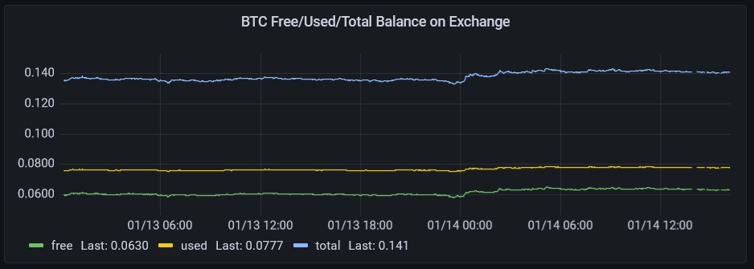

Given that the Dealer is using an inverse Bitcoin contract, the funds on exchange are BTC and used to buy USD.

So the Total balance is the number of BTC held on exchange as either collateral to the derivative USD position, unrealized PnL from that same position or just available funds to transact.

Trading and Funding fees are deducted directly from that balance.

The Total balance can be split in two: 

1. the "Free" part 
    - The Free balance is a safety margin kept by the Dealer to avoid liquidation if the market moves against the taken position. So it is part of the calculation that determines the liquidation price.
    - It is also a buffer that absorbs the trading as the USD liability varies triggering buys or sells to keep the hedge ratio constant.

1. the "Used" part.
    - The Used balance is the sum of the frozen funds that are actively held as collateral to the derivative USD position and the unrealized PnL of that position.

### Liquidation Price
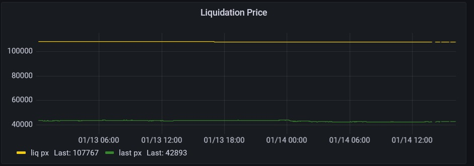

It is the approximate price at which, if no more BTC funds are added to the account, the position is force closed, 
i.e. the price at which the sum of the unrealized PnL and the balance reaches +/- zero or a certain limit greater than zero set by the exchange.
That lower limit is reached when the [Margin Ratio](./GRAFANA.md#Margin-Ratio) is below the [Maintenance Margin Ratio](./GRAFANA.md#Maintenance-Margin-Ratio).

In addition a Liquidation Fee is taken if triggered and is calculated according the current tier’s taker fee.

From the [Trading Fees](./GRAFANA.md#Trading-Fees) section,
we have:

Liquidation Fee = 0.005

#### Liquidation Price Derivation
Given the Total balance from the [BTC Balance on Exchange](./GRAFANA.md#BTC-Balance-on-Exchange) section,
the unrealized PnL from the [Unrealized PnL in BTC](./GRAFANA.md#Unrealized-PnL-in-BTC) section,
the Face Value and Number of Contracts from [Position Quantity in Contracts](./GRAFANA.md#Position-Quantity-in-Contracts) section,
the Average Open Price in USD from the [Average Open Price in USD](./GRAFANA.md#Average-Open-Price-in-USD) section,
the Margin Ratio formula from the [Margin Ratio](./GRAFANA.md#Margin-Ratio) section,
the Maintenance Margin Ratio from the [Maintenance Margin Ratio](./GRAFANA.md#Maintenance-Margin-Ratio) section,
the Swap PnL formula from the [Strategy Unrealized Profit and Loss](./GRAFANA.md#Strategy-Unrealized-Profit-and-Loss) section,
we have:

Total Balance = 0.141 BTC

uPnL = 0.0274 BTC

Balance = Total Balance - uPnL = 0.141 BTC - 0.0274 BTC = 0.1136

Face Value = 100 USD

Number of Contracts = 100

Open Price = 48.6k USD/BTC

Maintenance Margin Ratio = 0.005

```
Margin Ratio = (Balance + uPnL) * Liquidation Price / (Face Value * Number of Contracts)
Swap uPnL = (Face Value * Number of Contracts) * (1/(Liquidation Price) - 1/Open Price)
and
Liquidation @ Margin Ratio <= Maintenance Margin Ratio
```

So replacing the uPnL in the Margin Ratio and solving the inequality for Liquidation Price, 
we get using abbreviations:

```
Liquidation Price (Short) >= (FV * #Ct) * (1 - MMR) * OPx / ((FV * #Ct) - Opx * Balance)
Liquidation Price (Long)  >= (FV * #Ct) * (MMR + 1) * OPx / ((FV * #Ct) + Opx * Balance)
```

#### Liquidation Price Calculation

Liquidation Price (Short) >= 10,000 * (1 - 0.005) * 48,600 / (10,000 - 48,600 * 0.1136) = 107,963 USD

So, close enough to the OKEx calculator given that no liquidation fees were included.

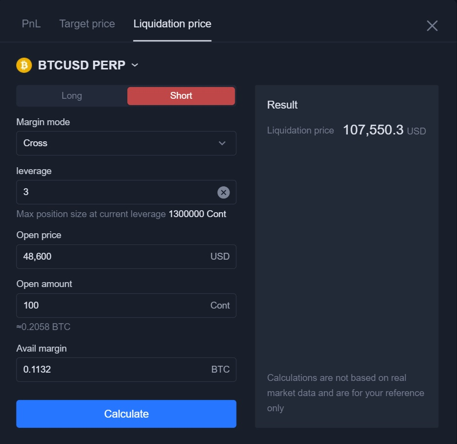

Liquidation Price (Long) >= 10,000 * (0.005 + 1) * 48,600 / (10,000 + 48,600 * 0.1136) = 31,469 USD


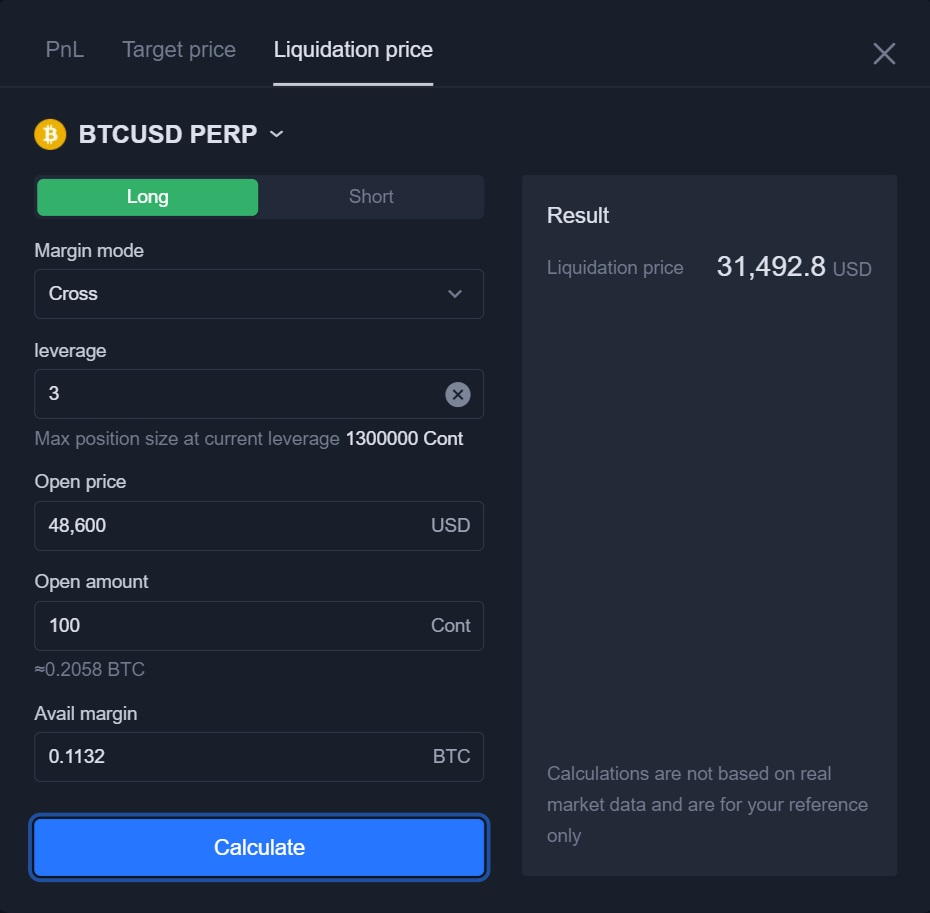


Further reading: [OKEx Margin & Leverage](https://www.okex.com/support/hc/en-us/articles/360020411531-VI-Margin-Leverage)

Further reading: [OKEx Tiered Maintenance Margin Ratio System](https://www.okex.com/support/hc/en-us/articles/360020152712-VII-Tiered-Maintenance-Margin-Ratio-System)

Further reading: [OKEx Forced Partial or Full Liquidation](https://www.okex.com/support/hc/en-us/articles/360020411711-VIII-Forced-Partial-or-Full-Liquidation)

### Exchange Leverage
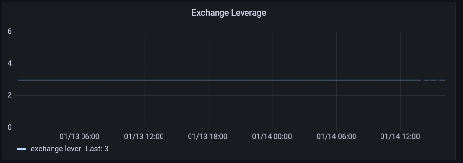

The leverage the Dealer sets and expects to be using on the exchange to take hedging positions. 
It allows for more effective use of funds put up as margin.
So at a leverage of 3, every unit deposited as collateral allows for a position 3x that size.

### Perpetuals Next Funding Rate
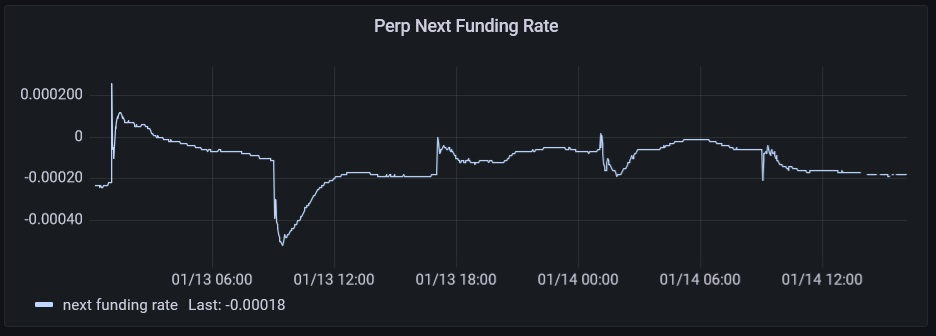

Funding fees are swapped between long and short positions (long to short if positive, short to long if negative) three times a day
as a mechanism to tie the swap price to spot price.

The Next Funding Rate shows the current level that can be expected to be "charged"/swapped at the next funding fee settlement.

Further reading: [OKEx Funding Rate Calculations](https://www.okex.com/support/hc/en-us/articles/360020412631-XI-Funding-Rate-Calculations)

## Last Price Driven Charts

### Position Leverage
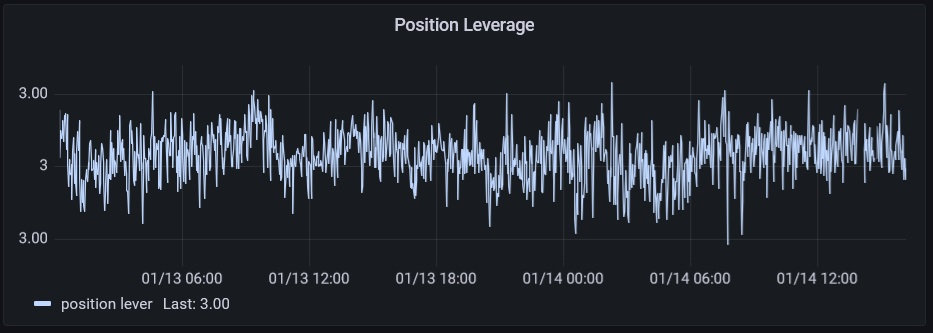

Manual calculation of the effective position leverage given the notional/exposure, the last price and the reported used margin.
It is expected to be the same as the Exchange Leverage used with little variance.

Position Leverage = Notional USD / (Used Balance BTC * Last Price USD/BTC)

### Perpetual basis in USD
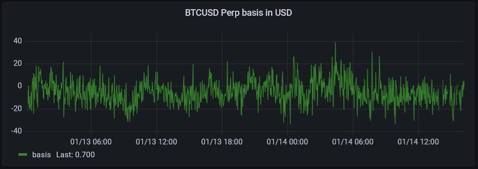

The difference between the Derivative Contract Last traded price and the Spot Index price. 
The quantity a [Long the basis](./README.md#What-Is-Long-the-Basis) trading strategy tries to capture.


## Risk Measure & Other Charts

### Margin Ratio
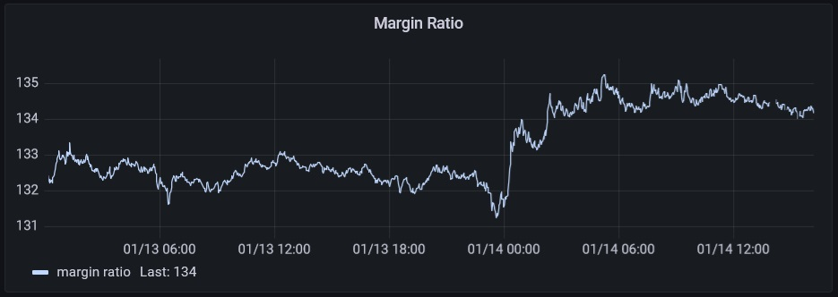

The Dealer operates in a "Cross Margin Mode" which sets a dynamic requirement for margin/collateral as the price fluctuates 
versus a "Fixed Margin Mode" which set a static requirement regardless of the price. 

Given that funds on exchanges are potentially at risk, managing them and keeping a balance in a more dynamic way is easier.

In "Cross Margin Mode", the Margin Ratio is defined as: 

```
Margin Ratio = (Balance + uPnL) in BTC / Position Value in BTC
and
Position Value = Face Value in USD * Number of Contracts / Latest Mark Price in USD/BTC

```

Given the Total balance from the [BTC Balance on Exchange](./GRAFANA.md#BTC-Balance-on-Exchange) section,
the Face Value and Number of Contracts from [Position Quantity in Contracts](./GRAFANA.md#Position-Quantity-in-Contracts) section,
the Latest Mark Price from [BTC Spot and Perp Price in USD](./GRAFANA.md#BTC-Spot-and-Perp-Price-in-USD) section,
we have:

```
Balance + uPnL = Total Balance = 0.141 BTC
Face Value = 100 USD
Number of Contracts = 100
Latest Mark Price = 42,892 USD/BTC
Position Value = 100 USD * 100 / 42,892 BTC = 0.23314371 BTC

Margin Ratio =  0.141 BTC / 0.23314371 BTC =  0.60477720
```

So not quite the number we get from the exchange as displayed in Grafana.
But to validate the formula (taken from OKEx) and the result, let's rearrange it as follow:

```
Margin Ratio = (Balance + uPnL) / (Face Value * Number of Contracts / Latest Mark Price)
Margin Ratio = (Balance + uPnL) * Latest Mark Price / (Face Value * Number of Contracts)
=>
Margin Ratio * (Face Value * Number of Contracts) = (Balance + uPnL) * Latest Mark Price = Total Account Value in USD
```

Total Account Value in USD = 6039 USD ~= 0.60477720 * 100 USD * 100 = 6048 USD,
from [Total Account Value in USD](./GRAFANA.md#Total-Account-Value-in-USD) section

So the Margin Ratio = 134 figure from the exchange seems to be factored by another number that does not seem to be documented anywhere.
Even [CCXT](https://github.com/ccxt/ccxt)'s code is reporting yet a different MarginRatio calculation as of 2022-01-20, v1.61.93.

Further reading: [OKEx Margin & Leverage](https://www.okex.com/support/hc/en-us/articles/360020411531-VI-Margin-Leverage)

Further reading: [OKEx Tiered Maintenance Margin Ratio System](https://www.okex.com/support/hc/en-us/articles/360020152712-VII-Tiered-Maintenance-Margin-Ratio-System)

Further reading: [OKEx Forced Partial or Full Liquidation](https://www.okex.com/support/hc/en-us/articles/360020411711-VIII-Forced-Partial-or-Full-Liquidation)

### Maintenance Margin Ratio
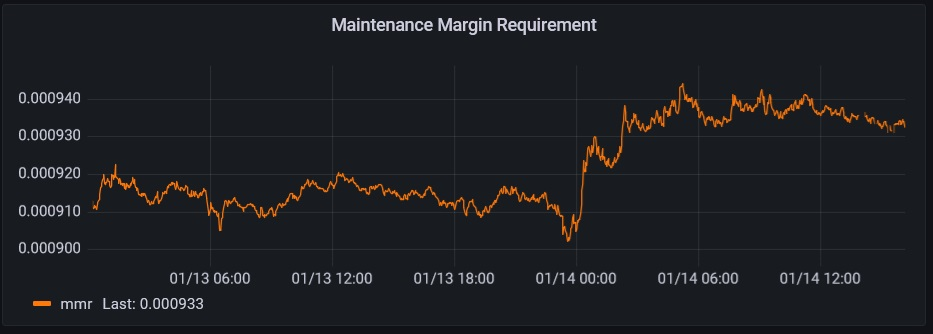

The Maintenance Margin Ratio is the lowest required Margin Ratio for maintaining the current open positions. 
When the Margin Ratio drops below the Maintenance Margin Ratio + Forced-Liquidation Fee Rate, forced liquidation is triggered.

In "Cross Margin Mode", it is determined based on the account's total number of Contracts on all positions as given by the table below as taken from OKEx:

|Maintenance Margin Ratio tiers (No. of swaps holding)|Maintenance margin ratio|
|:-----------------------------------------------------:|:------------------------:|
|[ 0, 999 ]|0.005|
|[ 1000, 9999 ]|0.01|
|[ 10000, 24999 ]|0.015|
|[ 25000, 49999 ]|0.02|

Given the Number of Contracts from [Position Quantity in Contracts](./GRAFANA.md#Position-Quantity-in-Contracts) section
we have:

Maintenance Margin Ratio = 0.005

Again here, the Maintenance Margin Ratio = 0.000933 figure from the exchange seems to be factored by another number that does not seem to be documented anywhere.

Further reading: [OKEx Margin & Leverage](https://www.okex.com/support/hc/en-us/articles/360020411531-VI-Margin-Leverage)

Further reading: [OKEx Tiered Maintenance Margin Ratio System](https://www.okex.com/support/hc/en-us/articles/360020152712-VII-Tiered-Maintenance-Margin-Ratio-System)

Further reading: [OKEx Forced Partial or Full Liquidation](https://www.okex.com/support/hc/en-us/articles/360020411711-VIII-Forced-Partial-or-Full-Liquidation)


### Unrealized PnL Ratio
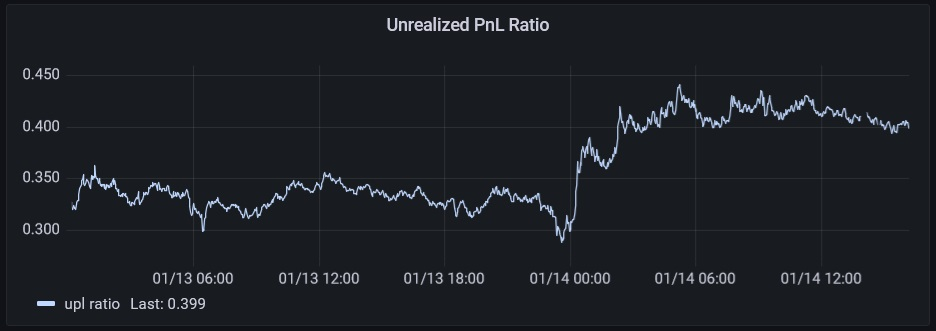

The Unrealized PnL Ratio is the current uPnL in proportion to the original exposure position in BTC and factoring in the leverage.
So it is a measure of percentage return over the funds invested or put at risk.

```
Unrealized PnL Ratio = uPnL / (Face Value * Number of Contracts / Average Open Price / Exchange Leverage)
```


### Unrealized PnL in BTC
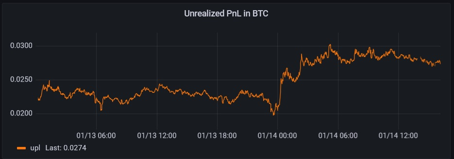

The Unrealized PnL on the derivative's position as reported by the exchange.

```
Swap PnL in BTC = Balance USD * (CurrentPrice - OpenPrice) BTC/USD
```


### Total Account Value in USD
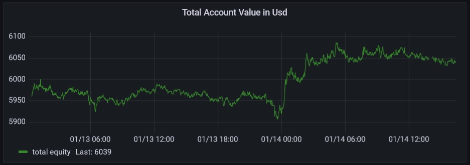

The Total balance (frozen & free) in USD as reported by the exchange.

### Position Collateral in USD
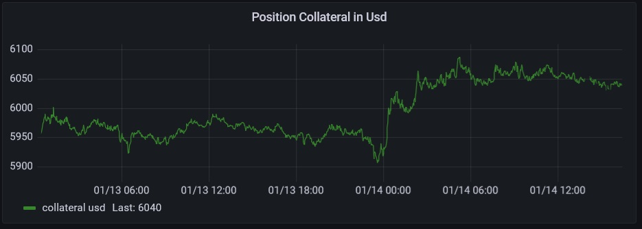

The total collateral in USD available on exchange. Same as [Total Account Value in USD](./GRAFANA.md#Total-Account-Value-in-USD)


### BTC Spot and Perp Price in USD
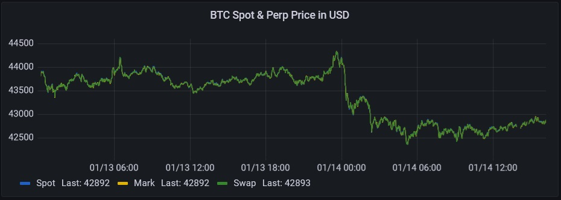


The Spot Index Price is the weighted average of the spot price in BTC/USD from 5 exchanges.
It is averaged in an effort to handle abnormal situations.
It is calculated as follow:

|Exchange|Weight|
|--------|------:|
|Bitstamp|20%|
|OKCoin|20%|
|Gemini|20%|
|Kraken|20%|
|Coinbase|20%|

The Mark Price is a smoothed Swap Contract Price used by the exchange for settlement, liquidation, etc.
It is used to avoid temporary spikes in price triggering unnecessary liquidations.
It is calculated as follow:

```
Mark price = Spot Index Price + Moving Average of Basis
and
Moving Average of Basis = MA((Best Offer + Best Bid)/2 - Spot Index Price)
```

The Swap Contract Price is the last traded price on the exchange.

Further reading: [OKEx Index Computation Rules](https://www.okex.com/support/hc/en-us/articles/360020149412-II-Index-Computation-Rules)

Further reading: [OKEx Mark Price](https://www.okex.com/support/hc/en-us/articles/360020411451-III-Mark-Price)

### Notional Lever
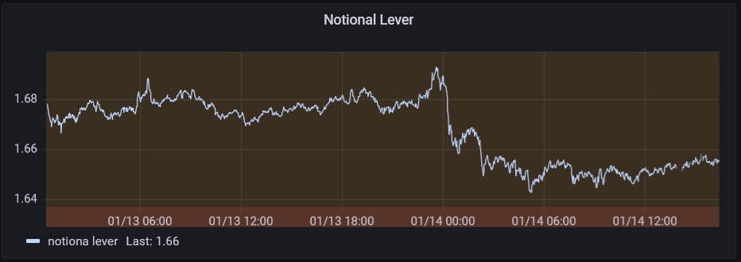

The Notional Lever is the ratio of the notional USD value ([Position Exposure in USD](./GRAFANA.md#Position-Exposure-in-USD)) 
and the [Position Collateral in USD](./GRAFANA.md#Position-Collateral-in-USD) as reported by the exchange.
The same ratio is independently calculated by the Dealer and reported as [Exposure Leverage Ratio](./GRAFANA.md#Exposure-Leverage-Ratio)

It is a measure of the effective leverage versus the [Exchange Leverage](./GRAFANA.md#Exchange-Leverage) given that the Dealer keeps extra funds on exchange as a risk management procedure.


Further reading: [OKEx Coin-margined Perpetual Swap](https://www.okex.com/support/hc/en-us/articles/360020149012-I-Introduction)


### Margin Leverage Ratio
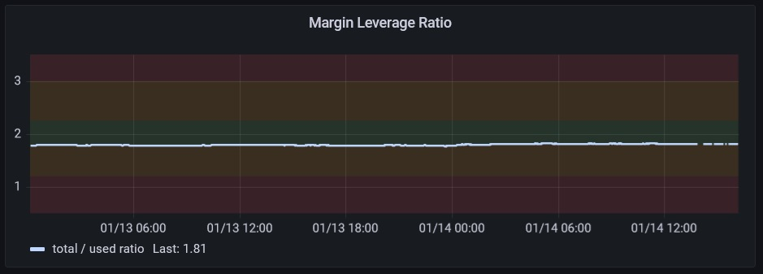

The Margin Leverage Ratio is the ratio of the Total Balance in BTC and the Used Balance in BTC.

It is a pure measure of the buffer above the required margin independent of the Exposure or Liability.

### Exposure Liability Ratio
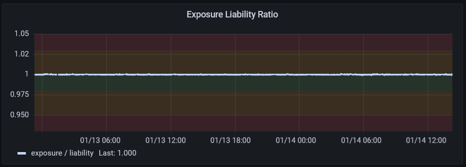

The Exposure Liability Ratio is the ratio of the ([Position Exposure in USD](./GRAFANA.md#Position-Exposure-in-USD)) 
and the [Liability in USD](./GRAFANA.md#Liability-in-USD) as calculated by the Dealer.

It is a measure of the effective hedge of the liability given that the Dealer aims at 1.0 but the incremental granularity depends on a contract face value of 100 USD. It is the measure used by the trading procedure.

For a current exposure level, as the liability moves higher the ratio shrinks and vice versa.

The trading procedure regarding the Exposure Liability Ratio is as follow:
1. if liability is zero, close (buyback) position if any
1. if ratio is below 0.95, sell rounded number of contracts up to a ratio of 0.98
1. if ratio is above 1.03, buyback rounded number of contracts up to a ratio of 1.00

Note that depending on conditions the execution of the desired transaction might not occur instantly (lack of collateral, fund transfer in-flight, etc.)

### Exposure Leverage Ratio
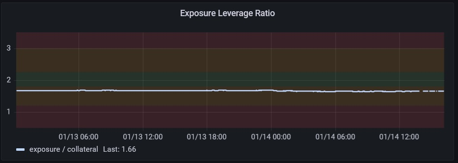

The Exposure Leverage Ratio is the ratio of the ([Position Exposure in USD](./GRAFANA.md#Position-Exposure-in-USD)) 
and the [Position Collateral in USD](./GRAFANA.md#Position-Collateral-in-USD) as calculated by the Dealer.

It is a measure of the effective leverage versus the [Exchange Leverage](./GRAFANA.md#Exchange-Leverage) given that the Dealer keeps extra funds on exchange as a risk management procedure.

For a constant exposure level, as the market price moves it is accounted as unrealized PnL which is part of the collateral and so for advantageous market price move the ratio shrinks and vice versa.

The risk management rules regarding the Exposure Leverage Ratio are as follow:
1. at zero funds on exchange, post 2.25x the required margin for a 3x exchange leverage
1. allow an upper limit of 3x before adding funds to the exchange down to 2.25x
1. allow an lower limit of 1.2x before moving funds out of the exchange up to 1.8x
