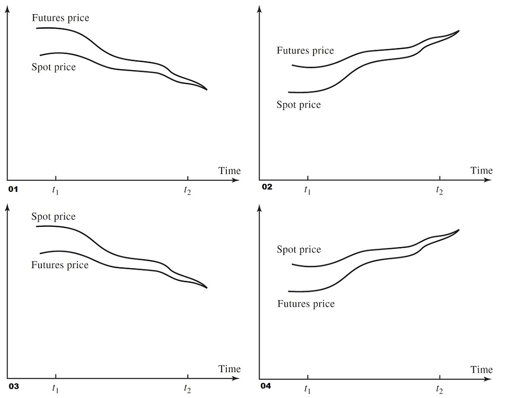

# Profit and Loss

## Something

### The Basis

The *basis* in a hedging situation is defined as follow:

    Basis = Spot price of asset to be hedged - Futures price of contract used to hedge

If both assets are the same, like in our case (versus a proxy asset underlying the futures), then the basis should be zero at expiry. 
Prior to that, the basis can be positive or negative.

It is important to note that even if both prices are related, they do not necessarily change by the same amount so can converge or diverge. Leading to the basis changing thru out the life of the contract while tending to zero at expiry.

Also important is whether the asset price at expiry is higher or lower than at trade time.

This leads to four cases

| case | basis | asset price |
| --- | ----- | ----------- |
| 1 | negative | lower |
| 2 | negative | higher |
| 3 | positive | lower |
| 4 | positive | higher |

<!-- 

 -->

For the purpose of the pnl analysis let's define these:

- S1 : spot price at time t1
- S2 : spot price at time t2
- F1 : futures price at time t1
- F2 : futures price at time t2
- b1 : basis at time t1
- b2 : basis at time t2.

By definition:

- b1 = S1 - F1
- b2 = S2 - F2

The hedge position is taken at t1 and closed out at t2, so the pnl is effectively the difference in futures prices. 
Given that the hedge is a short position, the Pnl is:

- Pnl = F1 - F2

